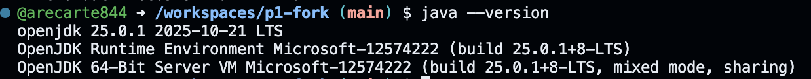
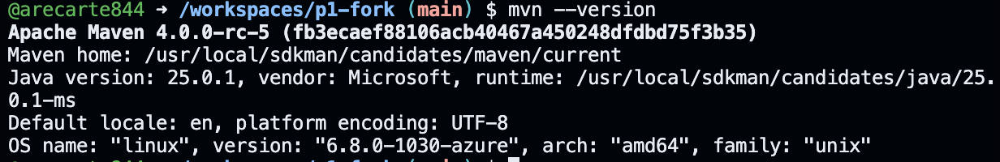
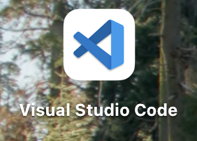

# Práctica 1 — Git y GitHub + Entorno Java

Repositorio de entrega: https://github.com/arecarte844/p1-fork

## Evidencias
- 📄 [git.txt](./git.txt)
- 📄 [entorno.txt](./entorno.txt)

## Capturas
### Java y Maven

### Editores

## Pasos realizados
1. Fork del repositorio `https://github.com/gitt-3-pat/p1`
2. Clonado con `git clone`
3. Prueba de comandos: `status`, `add`, `commit`, `push`, `checkout`
4. Evidencias del entorno: Java 17, Maven, VSCode, IntelliJ
